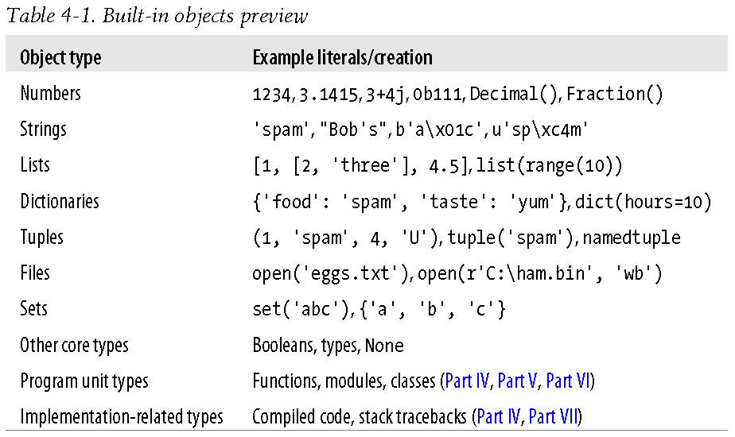
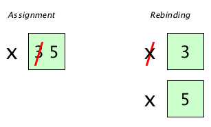
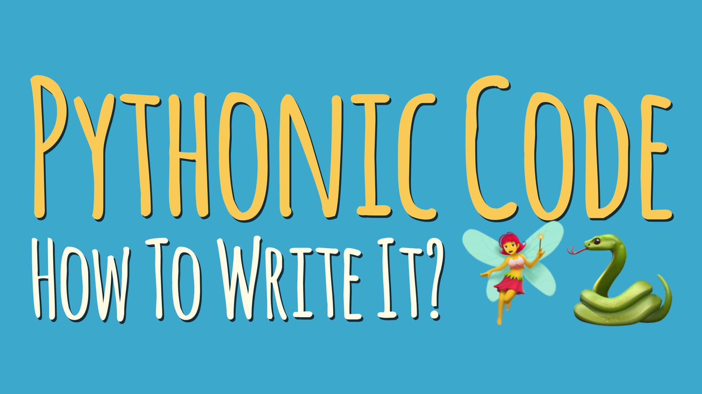

# Introducing Python Object Types
---

## The Python Conceptual Hierarchy


* **Programs** are composed of modules.
* **Modules** contain statements.
* **Statements** contain expressions.
* **Expressions** create and process objects.


## Python Object


* Traditional programming often stress its three pillars of
   * **sequence** ("Do this, then that")
   * **selection** ("Do this if that is true")
   * **repetition** ("Do this many times")


* Python has tools in all three categories, along with some for **definition**—of functions and classes.


* **object** : the more strongly unifying principle in Python
   * **Everything** we process in Python programs is a kind of object.


## Python's Core Data Types


* **built-in objects (types)** : the core of every Python program
   * The principal [built-in types](https://docs.python.org/3/library/stdtypes.html#range) : numerics, sequences, mappings, classes, instances and exceptions
      * **Numeric** types : `int`, `float`, `complex`
      * **Sequence** types : `list`, `tuple`, `range`
      * **Text sequence** type : `str`
      * **Binary sequence** types : `bytes`, `bytearray`, `memoryview`
      * **Set** types : `set`, `frozenset`
      * **Mapping** types : `dict`





* **literal** : an expression whose syntax generates an object—sometimes also called a **constant**.
   * Literals are notations for constant values of some built-in types.
   * There are *no* **type declarations** in Python. The syntax of the expressions (**object-generation expressions**) determines the types of obejcts.

```python
# a literal expression that generates and returns a new string object
'spam'
```


* **Identifier** or **Variable**
   * Python은 모든 것을 object로 다루기 때문에 **variable(변수)**보다는 변수, 상수, 함수, 사용자 정의 타입 등의 '이름'을 지칭하는 **identifier(식별자)**라는 용어를 사용한다.
   * 이름을 잘 짓는 것이 매우 중요하다!
      * (저장된 값의) 의미가 명확하게 드러나도록!
      * 기본적인 형식(규약)을 지켜서!
   * Case-sensitive names
      * **Camel case** : Python에서는 잘 사용하지 않는다.
         * e.g. camelCaseExample
      * **Pascal case** : class
         * e.g. PascalCaseExample
      * **Snake case** : function and variable
         * e.g. snake_case_example
    * 이름을 잘 짓는 것이 중요하다!


* **Assignment (할당, 대입)** vs. **Binding** (Python에서의 표현)
   * A variable is created when you assign it a value, may be assigned any type of object.
   * `=` : **assignment operator (할당 연산자)**





```python
# [Error] 'obj'라는 변수는 정의(선언)되지 않았으므로 사용할 수 없다.
obj
```


```python
# Print all interactive variables, with some minimal formatting.
%who
```


```python
# Return a sorted list of all interactive variables.
%who_ls
```


```python
# Like %who, but gives some extra information about each variable.
%whos
```

* Once you create an object, you **bind its operation set** for all time.
   * Python is **dynamically typed**.
      * A model **keeps track of types automatically** instead of requiring declaration code.
   * But it is also **strongly typed**.
      * **A constraint** that means you can perform on an object only operations that are valid for its type.


```python
# 1. 'obj' is a string object.
obj = 'spam'

# 자동으로
type(obj)
```


```python
len(obj)
```


```python
# 2. 'obj' is a list object.
obj = [1, 2, 3]

type(obj)
```


```python
len(obj)
```


```python
# 3. Now, 'obj' is a numeric (integer) object.
obj = 10

type(obj)
```


```python
# [Error] int object에는 len function을 사용할 수 없다. (또는 int object는 len method를 가지고 있지 않다.) 
len(obj)
```

## Numbers
---

### Numeric Objects


* **integers** that have no fractional part
* **floating-point** numbers with fractional part
* **complex** numbers with imaginary parts
* **decimals** with fixed precision
* **rational** numbers (유리수) with numerator (분자) and denominator (분모)
* full-featured **sets**
* **Booleans** : `True` or `False`


Numeric objects를 통해서 다시 한 번 binding 과정을 살펴봅시다. Assignment operator를 통해 값을 할당할 수 있습니다.


```python
x = 1

x
```

Assignment operator를 수학 기호인 등호와 혼동하면 안 됩니다.


```python
# '1 = 1 + 10'이라니?
x = x + 10

x
```

`float` type and numeric operation


```python
x = 1.1
y = 2.2
z = 3.3

# Why?
z == x + y
```

The other numeric objects in third-party libraries (e.g. matrixes and vectors)


```python
from decimal import Decimal

a = Decimal('.2')
b = Decimal('.1')
c = a + b

c
```

## Strings
---

* **string**: **immutable sequence** of **Unicode** code points
   * Python은 문자(낱자)와 문자열을 별도로 구분하지 않는다.
   * String literal은 **`'` (single quotes)** 또는 **`"` (double quotes)**로 묶어준다.


```python
type('A')
```


```python
type('Hello, world!')
```


```python
type("Apple")
```

Q. 문자열 안에 ' 또는 "를 포함시키고 싶다면?


```python
# TODO:
```

* 여러 줄의 string literal은 **`'''` 또는 `"""` (triple quoted)**로 묶어준다.
   * Triple quoted strings may span **multiple lines** - all associated whitespace will be included in the string literal.


```python
s = '''Hello,
world
and
Python!'''

s
```


```python
s = """Hello,
world
and
Python!"""

s
```


```python
print(s)
```


```python
s = '이렇게도 줄바꿈이 가능하지만, \
연결만 해줄 뿐 \
실제로 개행이 들어가지는 않는다.'

s
```


```python
print(s)
```

### Escape Code

`\n`는 갑자기 어디서 튀어나온 건가요?


```python
# TODO: 점프 투 파이썬 참조
```

### String Prefix

* **bytes literals**: `b''`, `B''`
   * They produce an instance of the bytes type instead of the str type.
* **raw strings**: `r''`, `R''`
   * They treat backslashes as literal characters.
* **formatted string literal (f-string)**: `f''`, `F''`
   * These strings may contain replacement fields, which are **expressions delimited by curly braces {}**. While other string literals always have a constant value, **formatted strings are really expressions evaluated at run time**.


```python
b = b'It is not the str type but the bytes type.'

type(b)
```


```python
b
```


```python
r = r'Backslash(\)를 literal character로 다룸으로써 \n, \t 등 escape characters를 허용하지 않는다.'

r
```


```python
print(r)
```


```python
a = 1
b = ': it is a expression evaluated at run time.'
f = f'a is {a}{b}'

f
```

### String Formatting


```python
# TODO: 점프 투 파이썬 참조
```

### Sequence


* **sequence** : a positionally ordered collection of other objects
   * Sequence types hold values in **an indexable and sliceable order**. (**순서**가 있다. = Indexing과 slicing이 가능하다.)
   * **left-to-right** order
   * **Sequence operations**
      * built-in `len` function
      * **indexing**: Indexes are coded as offsets from the front, and so start form 0.
         * Positive indexes count from the left, and negative indexes count back from the right.
         * We can use **an arbitrary expression** in the square brackets.
      * **slicing**: a way to extract an entire section (slice)
      * **concatenation** with +
      * **repetition** with *
      

#### Length of sequence


```python
s = 'Hello, Python!'

len(s)
```

#### Indexing


```python
# Positive index
s[0]
```


```python
# Negative index
s[-1]
```

Q. 숫자만 index로 사용할 수 있을까?


```python
# TODO:
```

#### Slicing


```python
# 세미콜론 뒤에 위치하는 index의 의미에 주의!
s[7:13]
```

Q. 위와 동일한 결과를 만드는 slicing 방법?


```python
# TODO:
```


```python
s[7:]
```


```python
s[:7]
```


```python
s[:]
```

자유롭게 indexing과 slicing 연습을 하다보면 문득 궁긍해질 것이다. 기존 object 's'는 어떻게 되었을까?


```python
# 's'는 변하지 않았다. Indexing과 slicing이 return(반환)하는 것은 새로운 object이기 때문이다.
s
```

### Polymorphism


* **polymorphism (다형성)**: A general property of Python. The meaning of an operation **depends on the objects** operated on.


```python
# Plus sign (+) means addition for numbers.
1 + 1
```


```python
# Plus sign (+) means concatenation for string.
'Hello, ' + 'Python!'
```

### Mutability


* **Mutable** : `list`, `dict`, `set`, `bytearray`, `memoryview`
   * **Mutable objects can change their value** but keep their id.


* **Immutable** : `numeric`, `str`, `tuple`, `frozenset`, `bytes`
   * **An object with a fixed value.** Immutable objects include numbers, strings and tuples. **Such an object cannot be altered.** A new object has to be created if a different value has to be stored. They play an important role in places where a constant hash value is needed, for example as a key in a dictionary.
   

Immutable objects **cannot be changed in place** after they are created.


```python
s
```


```python
# [Error] String은 immutable이므로 값을 직접 변경할 수 없다.
s[0] = 'h'
```

Q. 그렇다면, 첫 글자 H를 소문자로 변경하기 위해 어떻게 해야 할까?


```python
# TODO:
```

### Type-Specific Methods


* **method**: functions that are attached to and act upon a specific object, which are triggered with a **call expression**.
   * Methods act on the subject that they are attached to and called form.
   * **Generic operations** that span multiple types show up as
      * **built-in functions**: `len()`
      * **expression**: `str[0]`
   * but **type-specific operations** are
      * **method calls**: `str.find()`
   * Although some types share some method names, string method operations generally work only on strings, and nothing else.
      
      
※ [built-in functions](https://docs.python.org/3/library/functions.html): The Python interpreter has a number of functions and types built into it that are always available.


```python
s
```


```python
s.find('ll')
```


```python
s.replace('Hello', 'hello')
```

Q. `replace` method를 사용했는데도 's'는 변하지 않았다. 왜 그럴까?


```python
s
```

Q. `str`에 속하는 methods는 어떤 것들이 있는지 확인해보자. 'r'로 시작하는 methods는 몇 개일까?


```python
# TODO:
```

Q. 다음 코드는 어떻게 해석해야 할까?


```python
s.upper().split(',')
```

### Formatting


* **formatting**: an advanced **substitution operation** which strings support
   * **formatting expression**
   * **formatting method**
   
   
## Getting Help
---


### dir


* **`dir`**: a built-in function. It returns a list of **all the attributes available** for any object passed to it.


Q. `dir`을 알았으니 이제 우리는 `str`에 속한 모든 attributes와 methods(function attributes)의 개수를 알 수 있다. 총 몇 개일까?


```python
# TODO:
```

Built-in functions의 개수와 각각의 이름도 알 수 있다.


```python
len(dir(__builtin__))
```


```python
dir(__builtin__)
```

### Help


* **help**: a built-in function to ask what they do (to see **pydoc.help**)
   * **PyDoc**: a tool for extracting documentation from objects
   * **Docstring**: a string literal that occurs as the first statement in a module, function, class, or method definition
   
   
```python
help()
help(str)
help(s)
help('literal')
help(str.lower)
```


```python
# Shitf + Tab: cell을 실행하지 않고 바로 Docstring 보기
# Shitf + Tab을 연속으로 두 번 누르면 스크롤이 생성되면서 Docstring 전체를 볼 수 있다.
s.lower()
```

```python
# Introduction and overview of IPython's features
?

# Details about 'object'.
str?

# More detailed, verbose information about 'object'.
sys??
```


## Lists
---

* **list**: positionally ordered **collections** of arbitrarily typed objects
   * the most **general sequence** provided by Python (`list` may be reminiscent of arrays in other languages.)
   * *no* fixed **type constraint** (`list` can contain different types.)
   * *no* fixed **size** (`list` can grow and shrink.)
   * **mutable** (`list` can be changed inplace)


```python
l = [1, 'item in list', [10, 10., 0o10, 0x10]]

l
```


```python
id(l)
```


```python
l.append('new item')

l
```


```python
id(l)
```


```python
l[0] = 817

l
```


```python
id(l)
```

Q. Sequence operations를 사용해보자.


```python
# TODO:
```

Q. Type-specific operations를 사용해보자.


```python
# TODO:
```

### Bounds Checking


```python
l
```


```python
# [Error] 범위를 벗어난 위치에 대해 indexing 할 수 없다.
l[100]
```


```python
# [Error] 범위를 벗어난 위치에 값을 할당할 수 없다.
l[100] = 42
```

### Nesting


```python
# a 3 × 3 matrix, as nested lists
list_with_nested_lists = [[1, 2, 3],
                          [4, 5, 6],
                          [7, 8, 9]]

list_with_nested_lists
```

Q. `list_with_nested_lists`의 길이는?


```python
# TODO:
```

Q. Indexing을 어떻게 해야 할까. 먼저 두 번째 row [4, 5, 6]을 가져온 후, 세 번째 item 6만 가져와보자.


```python
# TODO:
```

### Comprehensions


* List comprehensions make **new lists** of results.
* They derive from set notation; they are a way to build a new list by running an expression on each item in a sequence, one at a time, from left to right.
* They tend to be very useful in practice and often provide a substantial processing speed advantage.
* **Other roles**: it's not just for making lists today.
   * List, sets, dictionaries, and generators can all be built with comprehensions.


```python
list_with_nested_lists = [[1, 2, 3],
                          [4, 5, 6],
                          [7, 8, 9]]
```


```python
col_list = [row[1] for row in list_with_nested_lists]

col_list
```


```python
col_list = [row[1] + 1 for row in list_with_nested_lists]

col_list
```


```python
col_list = [row[1] for row in list_with_nested_lists if row[1] > 3]

col_list
```

## Dictionaries
---

* **dict**: They are **mappings**; the only mapping type in Python's core objects set.
   * **collections** of other objects
   * *not* **sequence**: Mappings *don't* maintain any reliable left-to-right **order**; it may be scrambled.
   * **mapping** (a series of **key and value** pairs): They simply map **mnemonic keys** to associated values.
      * Keys must be of **immutable** types.
   * **mutable**
   
   
```python
d = {'이름': '김태진', '학교': '가천대', '학년': 4, '수강과목': ['의료영상', '생체신호처리']}
```


```python
d = {'name': 'Taejin Kim', 'university': 'Gachon Univ.', 'grade': 3, 'lectures': ['Medical Imaging', 'Biosignal Processing']}

d
```

* Dictionaries can also be used **to replace searching operations**—indexing a dictionary by key is often **the fastest way** to code a search in Python.


We can index dictionary **by key** to **fetch** and **change** the keys' associated values.


```python
# Fetch
d['name']
```


```python
# Change
d['grade'] = 4

d
```

Unlike out-of-bounds assignments in lists, which are forbidden, **assignments to new dictionary keys** create those keys.


```python
# An empty dictionary
d = {}

d
```


```python
# Add a new key and the keys' associated value.
d['name'] = 'Taejin Kim'

d
```


```python
d['university'] = 'Gachon Univ.'
d['grade'] = 4
d['lectures'] = ['Medical Imaging', 'Biosignal Processing']

d
```

### Nesting


```python
d['name'] = {'first': 'Taejin', 'last': 'Kim'}

d
```

Q. Indexing dictionary by key로 first name 가져오기. 


```python
# TODO:
```

Q. 수강과목 추가하기.


```python
# TODO:
```

Q. 마지막으로 추가한 수강과목 indexing 하기.


```python
# TODO:
```

### Missing Keys


```python
# [Error] 'age'란 Key는 존재하지 않는다. Referencing a nonexistent key is an error.
d['age']
```

* How to avoid `KeyError`? **1) To test ahead of time**


```python
d.items()
```


```python
d.keys()
```


```python
d.values()
```

**`in`: membership expression**


```python
1 in [1, 2, 3]
```


```python
't' in 'Python'
```


```python
'th' in 'Python'
```


```python
1.0 in [1, 2, 3]
```


```python
'p' in 'Python'
```


```python
'age' in d
```

**`if` statement**: the main **selection** statement tool in Python


```python
if 'age' in d:
    d['age']
```

* How to avoid `KeyError`? **2) `get` method**: a conditional index with a default


```python
d.get('age')
```


```python
# Key가 존재하지 않을 경우 반환되는 default 값은 None
print(d.get('age'))
```


```python
# Key가 존재하지 않을 경우 반환되는 값을 0(get method에 전달되는 두 번째 argument(인자))으로 지정
d.get('age', 0)
```

사실 get method는 **`if`/`else` ternary expression**(an `if` statement squeezed onto a single line)으로 정의되어 있다.


```python
d['age'] if 'age' in d else 0
```

### Iteration and Optimization


* **iterable**: either a physically stored **sequence in memory** or **an object that generates one item at a time** in the context of an iteration operation.
   * For loop and list comprehension expression work on any iterable object.
   * [Iterables vs. Iterators vs. Generators](https://nvie.com/posts/iterators-vs-generators/)


* **Iterable objects** support the **iteration protocol**—they respond to the **iter** call with an object that advances in response to **next** calls and raises an exception when finished producing values.


* **generator**: its values are *not* **stored in memory all at once**, *but* are **produced as requested**, usually by iteration tools.
* **file object**: it similarly iterate **line by line**; it's fetched **on demand**.
* Every Python tool that scans an object **from left to right** uses the **iteration protocol**.

Q. 아니 그런데, 코딩만 잘 하면 되지 이런 걸 꼭 알아야 해요?


```python
# TODO: 빈 list 생성
list()
```


```python
# TODO: list의 소괄호 안에 커서를 두고 Shitf + Tab을 눌러보자!
list(d.keys())
```

## Tuples
---

* **tuple**: toughly like a list that cannot be changed; they're used to represent fixed collections of items.
   * **immutable sequence**
   * They support **arbitrary types**, **arbitrary nesting**, and the usual **sequence operations**.

Q. `lsit`와 매우 비슷해보인다! 그리고 이제 우리는 sequence와 immutable이 무엇인지 안다! 그렇다면, `tuple`로 무엇을 할 수 있을지 추론해보자.


```python
# TODO:
```

다음과 같이 한 개의 아이템을 갖는 튜플을 만들 때 주의!


```python
t = (1)

type(t)
```


```python
t
```


```python
t = (1,)

type(t)
```


```python
t
```


```python
t = (1, 2, 3)

# [Error] Tuples are immutable sequences.
t[0] = 0
```


```python
# [Error] Tuples don't grow and shrink.
t.append(4)
```

### Tuple Packing


* 소괄호를 생략해도 값들이 묶여서(values are packed together) tuple이 된다.


```python
d = 1, 2, 3, 4, 5

type(d)
```


```python
d
```

### Sequence Unpacking


* **The reverse operation** of tuple packing.
* Sequence unpacking requires that there are as many variables on the left side of the equals sign as there are elements in the sequence.
* **Multiple assignment** is really just a combination of tuple packing and sequence unpacking.


```python
a, b, c = 1, 2, 3
# a, b, c = 1, 2, (3, )
# a, b, c = 1, 2, [3, 4]
```


```python
type(a)
```


```python
type(b)
```


```python
type(c)
```


```python
# [Error] 할당 연산자 왼쪽의 식별자 개수와 오른쪽의 값(요소) 개수가 같지 않은 경우
a, b, c = 1, 2
```


```python
# [Error] 할당 연산자 왼쪽의 식별자 개수와 오른쪽의 값(요소) 개수가 같지 않은 경우
a, b, c = 1, 2, 3, 4
```

*을 사용하면 유동적인 packing, unpacking이 가능하다.


```python
# 첫 요소만 a에 pack, 나머지 전부를 b에 pack
a, *b = 1, 2, 3, 4, 5
```


```python
a
```


```python
b
```


```python
# 마지막 요소만 b에 pack, 나머지 전부를 a에 pack
*a, b = 1, 2, 3, 4, 5
```


```python
a
```


```python
b
```


```python
# 첫 요소를 a에, 마지막 요소를 c에, 나머지 전부를 b에 pack
a, *b, c = 1, 2, 3, 4, 5
```


```python
a
```


```python
b
```


```python
c
```

C에서는 temp 변수 만들어서 해야 했던 swapping arguments가 Python에서는 이렇게 간단하다.


```python
a = 5
b = 10

"""
temp = a
a = b
b = temp
"""

a, b = b, a
```


```python
a
```


```python
b
```

## Files
---

컴퓨터는 영원히, 제약 없이 모든 변수의 값을 기억할 수 있을까? 메모리상의 정보는 커널 또는 컴퓨터를 재시작하면 삭제되어 재사용할 수 없다. 따라서 파일로 저장해야 정보를 보존할 수 있다.


* **file**: main interface to **external files** on your computer
   * Files are a core type, but they're something of an **oddball**—there is *no* **specific literal syntax** for creating them. Rather, to create a file object, you call the **built-in `open` function**.


```python
# Write a file.
f = open('test.txt', 'w')
f.write('Hello\n')
f.write('word\n')
f.close()
```


```python
# Read a file.
f = open('test.txt', 'r')
text = f.read()
f.close()

text
```

### Two ways to print every object in Python


* **`repr`**: as-code


```python
text
```


```python
print(text.__repr__())
```

* **`str`**: user-friendly


```python
print(text)
```


```python
print(text.__str__())
```

## Other Core Types
---

* **set**: **unordered collections** of unique and immutale objects: neither mappings nor sequences


```python
l = [1, 2, 3, 4, 5, 4, 3, 2, 1, 1, 1]

l
```


```python
set(l)
```


```python
{n ** 2 for n in [1, -1, 2, -2, 3, -3]}
```

* **decimal** for **fixed-precision** floating-point numbers
* **Fraction** for rational numbers
* **Booleans**: **True (1)** or **False (0)** objects
* **None**: **placeholder object**


```python
placeholder = None

plc
```

Q. 초록색 코드, 넌 누구냐?


```python
# TODO:
```

## Type
---

* **type**: obect that gives **the type of another object**; it's returned by the **`type` built-in function**
* **type are classes**, and vice versa (Python 3.X)


```python
l = [1, 2, 3]

print(type(l))
```


```python
print(type(type(l)))
```

### Type Testing


* Code to check the types of the objects


```python
type(l) == type([])
```


```python
type(l) == list
```


```python
isinstance(l, list)
```

* But it is almost always the wrong thing to do in a Python program.


### **"Pythonic!"**





* **Polymorphism** is probably the key idea behind using Python well.
* We code to **object interfaces (operations supported)**, not to types. That is, We care what an object **does**, not what it **is**.


### Again, everything in Python is an **"object"**.


## Chapter Summary
---

* Python's core object types: flexible and powerfule
* Generic operations
* Type-specific operations
* Key terms, such as immutability, sequences, and polymorphism


[To Home](../index.md)  
[To Lecture List](../lecturelist.md)