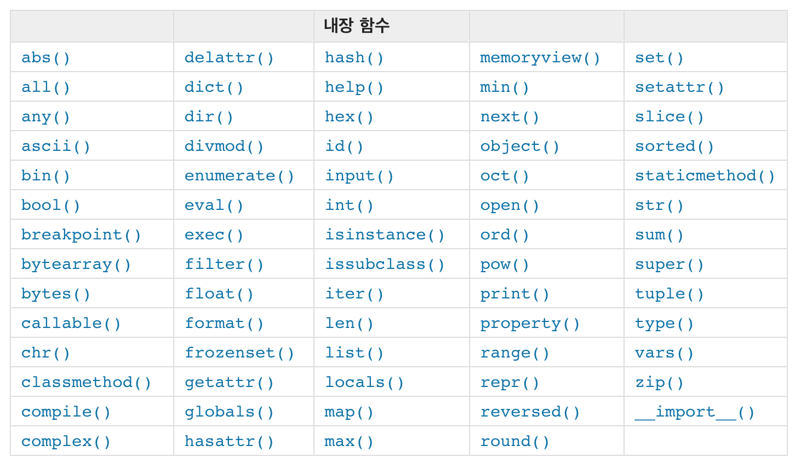

# Module

- 함수, 클래스등을 모아놓은 스크립트 파일.

## Why Use Module
- 효율성
    - 자주 사용하는 함수....매번 스크립트에 선언하기 귀찮음..
    - 스크립트에 **딱 한번** 적어놓고 쓰자!


```python
%%writefile arithmetic.py
def add(x, y):
    """
    x+y
    """
    return x + y

def sub(x, y):
    """
    x-y
    """
    return x - y

def mul(x, y):
    """
    x*y
    """
    return x*y

def div(x, y):
    """
    x/y
    """
    return x/y
```

```python
import 모듈이름
```
- 모듈을 import 하겠다.


```python
import arithmetic
```


```python
print(arithmetic.add(5, 2))
print(arithmetic.sub(5, 2))
print(arithmetic.mul(5, 2))
print(arithmetic.div(5, 2))
```

``` python
import 모듈이름 as 별칭
```
- 모듈이름을 import 하고 별칭 이라고 하겠다.


```python
import arithmetic as am
```


```python
print(am.add(5, 2))
print(am.sub(5, 2))
print(am.mul(5, 2))
print(am.div(5, 2))
```

```python
from 모듈이름 import 모듈 함수 
```
- 모듈이름 에서 모듈함수를 import 하겠다.

```python
from 모듈이름 import * 
```
- 모듈이름 에서 모든 모듈함수를 import 하겠다.


```python
from arithmetic import *
```


```python
print(add(5, 2))
print(sub(5, 2))
print(mul(5, 2))
print(div(5, 2))
```

``` python
from 모듈이름 import 모듈함수 as 별칭
```

- 모듈이름 에서 모듈함수를 import 하고 별칭 이라고 하겠다.


```python
from arithmetic import add as func_1
from arithmetic import sub as func_2
from arithmetic import mul as func_3
from arithmetic import div as func_4
```


```python
print(func_1(5, 2))
print(func_2(5, 2))
print(func_3(5, 2))
print(func_4(5, 2))
```

# Package
- 모듈들을 폴더(디렉토리)의 구조로 관리할 수 있도록 해줌.


- 모듈을 패키지로 취급하게 하기 위해선 `__init__.py` 파일이 필요.
    - python 3.3 이상에선 필요 없으나 호환성을 위해.....


```bash
--self_package
  -- __init__.py
  -- test_math.py
  -- module1
    -- test_math.py
  -- module2
    -- test_math.py
    
```

`test_math.py` 내용은 다음 과 같음. 

``` python
#test_math.py
def add(x, y):
    """
    x+y
    """
    return x + y

def sub(x, y):
    """
    x-y
    """
    return x - y

def mul(x, y):
    """
    x*y
    """
    return x*y

def div(x, y):
    """
    x/y
    """
    return x/y
```


```python
# docstring에서 file 경로 확인!
from self_package import test_math as package
print(package.add(1, 2))
print(package.sub(1, 2))
print(package.mul(1, 2))
print(package.div(1, 2))
```


```python
# docstring에서 file 경로 확인!
from self_package.module1 import test_math as module1
print(module1.add(1, 2))
print(module1.sub(1, 2))
print(module1.mul(1, 2))
print(module1.div(1, 2))
```


```python
# docstring에서 file 경로 확인!
from self_package.module2 import test_math as module2
print(module2.add(1, 2))
print(module2.sub(1, 2))
print(module2.mul(1, 2))
print(module2.div(1, 2))
```


```python
from test_dir.sub_test1 import test as sub1
```


```python
sub1.add()
```


```python
from test_dir.sub_test2 import test as sub2
```

# Built-in Functions 

- 파이썬에는 기본적으로 많은 함수들을 제공.

- [참고 링크](https://docs.python.org/ko/3/library/functions.html)




```python
# abs()
print("Test abs : ", abs(-5))

# sum()
print("Test sum : ", sum([1, 2, 4, 5, 6, 7]))

# max()
print("Test max : ", max(50, 30, 10, 55, 20, 300))

# min()
print("Test min : ", min(50, 30, 10, 55, 20, 300))

# pow()
print("Test pow : ", pow(5, 4))

# round()
print("Test round : ", round(3.2245))

# sorted()
print("Test sorted : ", sorted([5,4,3,2,1]))

# len()
print("Test len : ", len("python"))
```

# 외장 함수 (표준 라이브러리)
- 파이썬이 설치될때 같이 설치되는 패키지들.
- built-in function 과는 다르게 import 를 하여 사용.

- list
    - os (운영 체제 인터페이스)
    - glob (파일 목록 검색)
    - sys (스크립트 명령어)
    - re (정규 표현식)
    - math (수학)
    - urllib (인터넷 액세스)
    - datatime (날짜와 시간)
    - zlib, gzip, lzma,... (데이터 압축)
    - timeit (성능 측정)
    - random (난수 발생)
    - ...
  
  
 - [표준 라이브러리 둘러보기 -1](https://docs.python.org/ko/3/tutorial/stdlib.html)
 - [표준 라이브러리 둘러보기 -2](https://docs.python.org/ko/3/tutorial/stdlib2.html)


```python
import random
random.randint(1, 9)
```


    8


```python
import glob
# * 은 와일드카드 라고 하며 여러 파일을 한꺼번에 지정할 때 사용.
glob.glob('./*.py')
```


    ['./lambda_yield.py',
     './arithmetic.py',
     './assignment_solution.py',
     './my_math.py']


[와일드카드](https://ko.wikipedia.org/wiki/%EC%99%80%EC%9D%BC%EB%93%9C%EC%B9%B4%EB%93%9C_%EB%AC%B8%EC%9E%90)

# Error & Exception

- 프로그램을 통한 제어의 흐름을 수정할 수있는 이벤트.

- SyntaxError
    - 문법 에러, 파싱 에러라고 하며 이름 그대로 문법에 오류가 있을 때 발생하는 에러.
    - 에러가 발생한 위치를 ^ 를 이용하여 표시해줌.
   
- Exception
    - 문법, 표현식에는 문제가 없지만 다른 이유로 발생하는 에러.
    - 예외가 발생한 Line을 표시.
    
    
- try/except/else/finally


- raise
- assert


## Built-in exception


```python
print("sdw"
```


```python
if i:
print("Hello")
```


```python
print(test)
```


```python
print(2/0)
```


```python
print("4"+5)
```


```python
print(5+"3")
```

- 이 외에도 매~~~~우 많은 Built-in exception 이 존재.  
[Built-in exception list](https://docs.python.org/ko/3/library/exceptions.html)

## try/except/else/finally


```python
# try/except
try:
    print("try clause")
    x = int(input("Please input a number : "))
except :
    print("except clause")
    print("Oops! That was no valid number.  Try again...")

```


```python
#try/except/except
try:
    print("Try clause")
    x = int(input("Please input a number : "))
    print(y)
except ValueError:
    print("1st except clause")
    print("ValueError !")
    
except NameError:
    print("2nd except clause")
    print("NameError !")
```


```python
try:
    print("Try clause")
    x = int(input("Please input a number : "))
    print(y)
except ValueError as e:
    print("1st except clause")
    print("ValueError !")
    print(e)
    
except NameError as e:
    print("2nd except clause")
    print("NameError")
    print(e)
```


```python

try:
    print("\n---------------------")
    print("Try clause")
    x = int(input("Please input a number : "))
except ValueError as e:
    print("\n---------------------")
    print("except clause")
    print(e)

else:
    print("\n---------------------")
    print("nelse clause")
    print("x is ", x)
    
finally:
    print("\n---------------------")
    print("finally clause")
    print("End Exception")
```


```python
try:
    raise Exception("Exception!", "What!?")
except Exception as e:
    print(e)
    print(type(e))
    print(e.args)
```

## 자신 만의 Exception & raise


```python
class SelfError(Exception) : 
    pass
```


```python
while True:
    try:
        print("\n---------------------")
        print("Try clause")
        x = int(input("Please input a number : "))
        if x<10:
            raise SelfError("args1", "args2")
        break
        
    except ValueError as e:
        print("\n---------------------")
        print("1st except clause")
        print(e)
    
    except SelfError as e:
        print("\n---------------------")
        print("2nd except clause")
        print(e)
        raise
```


```python
while True:
    try:
        print("\n---------------------")
        print("Try clause")
        x = int(input("Please input a number : "))
        if x<10:
            raise SelfError()
        break
        
    except ValueError as e:
        print("\n---------------------")
        print("1st except clause")
        print(e)
    
    except SelfError as e:
        print("\n---------------------")
        print("2nd except clause")
        print(e)
        raise
```


```python
try:
    print("\n---------------------")
    print("Try clause")
    x = int(input("Please input a number : "))
    if x <10:
        raise ValueError("Lower than 10!!")
except ValueError as e:
    print("\n---------------------")
    print("except clause")
    raise

else:
    print("\n---------------------")
    print("else clause")
    print("x is ", x)
    
finally:
    print("\n---------------------")
    print("finally clause")
    print("End Exception")
```


```python
while True:
    try:
        print("\n---------------------")
        print("Try clause")
        x = int(input("Please input a number : "))
        if x <10:
            raise ValueError("Lower than 10!!")
        
    except ValueError as e:
        print("\n---------------------")
        print("except clause")
        print(e)
        #raise
    
    else:
        print("\n---------------------")
        print("else clause")
        print("Now is else time.")
        break
        
    finally:
        print("\n---------------------")
        print("finally clause")
        print("End Exception")
```

## assert


```python
test_assertion = [1, 2, 3, 4]
assert len(test_assertion) == 3, "Assertion Error!"
```


```python
def confirm_int(x):
    assert type(x) == int, "x is not int !"
    return x
```


```python
confirm_int(0.2)
```

[To Home](../index.md)  
[To Lecture List](../lecturelist.md)