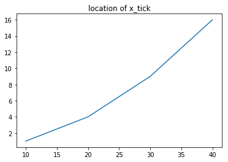

# 시각화 패키지 Matplotlib 소개

#### MATLAB에서 영감을 얻은 Python 플로팅 라이브러리이다. 사용되는 용어(Axis, Figure, Plots)는 MATLAB에서 사용되는 용어와 유사하다.
#### Matplotlib는 파이썬에서 자료를 차트(chart)나 플롯(plot)으로 시각화(visualization)하는 패키지이다.
#### Matplotlib는 다음과 같은 정형화된 차트나 플롯 이외에도 저수준 api를 사용한 다양한 시각화 기능을 제공한다.
* 라인 플롯(line plot)
* 스캐터 플롯(scatter plot)
* 컨투어 플롯(contour plot)
* 서피스 플롯(surface plot)
* 바 차트(bar chart)
* 히스토그램(histogram)
* 박스 플롯(box plot)

#### Matplotlib를 사용한 시각화 예제들을 보고 싶다면 Matplotlib 갤러기 웹사이트를 방문한다.
* http://matplotlib.org/gallery.html

## 1. Pyplot
#### Pyplot은 MATLAB에 익숙한 사람들이 쉽게 사용할 수 있도록 Matplotlib에 대한 '쉘형' 인터페이스이다.


```python
import matplotlib.pyplot as plt
import numpy as np

x = np.linspace(0, 10, 9) #0부터 10사이를 9등분으로 쪼갠 리스트 생성
y = np.random.randn(9) #평균값이 0, 표준편차가 1인 가우시안 표준정규분포를 따르는 1*9 크기의 난수를 발생함

plt.scatter(x, y)
plt.show()
```


```python
import matplotlib.pyplot as plt
import numpy as np

x = np.linspace(0, 10, 9) #0부터 10사이를 9등분으로 쪼갠 리스트 생성
y = np.random.randn(9) #평균값이 0, 표준편차가 1인 가우시안 표준정규분포를 따르는 1*9 크기의 난수를 발생함

plt.scatter(x, y)
```


    <matplotlib.collections.PathCollection at 0x22bf5a72160>


## 2. Pylab
#### Pyplot과 Numpy를 하나로 결합하는 아이디어이다.


```python
from matplotlib.pylab import *

x = linspace(0, 10, 9)
y = randn(9)

scatter(x, y)
show()
```


## 3. 라인 플롯
#### 가장 간단한 플롯은 선을 그리는 라인 플롯(line plot)이다. 라인 플롯은 데이터가 시간, 순서 등에 따라 어떻게 변화하는지 보여주기 위해 사용한다.
#### 명령은 pyplot 서브패키지의 plot 명령을 사용한다.
* http://Matplotlib.org/api/pyplot_api.html#Matplotlib.pyplot.plot

#### 데이터가 1, 4, 9, 16 으로 변화하였다면 다음과 같이 plot 명령에 데이터 리스트 혹은 ndarray 객체를 넘긴다.


```python
plt.title("Plot")
plt.plot([1, 4, 9, 16])
plt.show()
```


#### 이 때 x 축의 자료 위치 즉, 틱(tick)은 자동으로 0, 1, 2, 3이 된다. 
#### 만약 이 x_tick 위치를 별도로 명시하고 싶다면 다음과 같이 두개의 같은 길이의 리스트 혹은 배열 자료를 넣으면 된다.


```python
plt.title("location of x_tick")
plt.plot([10, 20, 30, 40], [1, 4, 9, 16])
plt.show()
```





#### show 명령은 시각화 명령을 실제로 차트로 렌더링(rendering)하고 마우스 움직임 등의 이벤트를 기다리라는 지시이다.
#### 주피터 노트북에서는 셀 단위로 플롯 명령은 자동 렌더링 해주므로 show 명령이 필요없지만 일반 파이썬 인터프리터로 가동되는 경우를 대비하여 항상 마지막에 실행한다.
#### show 명령을 주면 마지막 플롯 명령으로부터 반환된 플롯 객체의 표현도 가려주는 효과가 있다.

## 3-1. 스타일 지정

#### 플롯 명령어는 보는 사람이 그림을 더 알아보기 쉽게 하기 위해 다양한 스타일(style)을 지원한다.
#### plot 명령어에서는 다음과 같이 추가 문자열 인수를 사용하여 스타일을 지원한다.


```python
plt.title("'rs--' style plot ")
plt.plot([10, 20, 30, 40], [1, 4, 9, 16], 'rs--')
plt.show()
```


#### 스타일 문자열은 색깔(color), 마커(marker), 선 종류(line style)의 순서로 지정한다. 만약 이 중 일부가 생략되면 디폴트값이 적용된다.

### 3-1-1. 색깔
#### 색깔을 지정하는 방법은 색 이름 혹은 약자를 사용하거나 # 문자로 시작되는 RGB 코드를 사용한다.
#### 자주 사용되는 생깔은 한글자 약자를 사용할 수 있으며 약자는 아래 표에 정리하였다. 전체 색깔 목록은 다음 웹사이트를 참조한다.
* http://Matplotlib.org/examples/color/named_colors.html


```python
#플롯 수정하기: 선 색상과 스타일
x = np.linspace(0, 10, 100)

plt.plot(x, np.sin(x - 0), color='blue')           # 색상을 이름으로 지정
plt.plot(x, np.sin(x - 1), color='g')              # 짧은 색상 코드(rgbcmyk)
plt.plot(x, np.sin(x - 2), color='0.75')           # 0과 1 사이로 회색조 지정
plt.plot(x, np.sin(x - 4), color=(1.0, 0.2, 0.3))  # RGB 튜플, 0과 1 값
plt.show()
```


### 3-1-2. 마커
#### 데이터 위치를 나타내는 기호를 마커(marker)라고 한다. 마커의 종류는 다음과 같다.


### 3-1-3. 선 스타일
#### 선 스타일에는 실선(solid), 대시선(dashed), 점선(dotted), 대시-점선(dash-dot) 이 있다. 지정 문자열은 다음과 같다.


### 3-1-4. 기타 스타일
#### 라인 플롯에서는 앞서 설명한 세 가지 스타일 이외에도 여러가지 스타일을 지정할 수 있지만 이 경우에는 인수 이름을 정확하게 지정해야 한다. 사용할 수 있는 스타일 인수의 목록은 Matplotlib.lines.Line2D 클래스에 대한 다음 웹사이트를 참조한다.
* http://Matplotlib.org/api/lines_api.html#Matplotlib.lines.Line2D

#### 라인 플롯에서 자주 사용되는 기타 스타일은 다음과 같다.


```python
plt.plot([10, 20, 30, 40], [1, 4, 9, 16], c="b",
         lw=5, ls="--", marker="o", ms=15, mec="g", mew=5, mfc="r")
plt.title("Example of applying styles")
plt.show()
```


## 3-2. 그림 범위 지정
#### 플롯 그림을 보면 몇몇 점들은 그림의 범위 경계선에 있어서 잘 보이지 않는 경우가 있을 수 있다. 
#### 그림의 범위를 수동으로 지정하려면 xlim 명령과 ylim 명령을 사용한다. 
#### 이 명령들은 그림의 범위가 되는 x축, y축의 최소값과 최대값을 지정한다.


```python
plt.title("the range of the x-axis and y-axis")
plt.plot([10, 20, 30, 40], [1, 4, 9, 16],
         c="b", lw=5, ls="--", marker="o", ms=15, mec="g", mew=5, mfc="r")
plt.xlim(0, 50)
plt.ylim(-10, 30)
plt.show()
```


## 3-3. 틱 설정
#### 플롯이나 차트에서 축 상의 위치 표시 지점을 틱(tick)이라고 하고 이 틱에 써진 숫자 혹은 글자를 틱 라벨(tick label)이라고 한다.
#### 틱의 위치나 틱 라벨은 Matplotlib가 자동으로 설정해주지만 만약 수동으로 설정하고 싶다면 xticks, yticks 명령을 사용한다.


```python
X = np.linspace(-np.pi, np.pi, 256)
C = np.cos(X)
plt.title("Tick label setting for x-axis and y-axis")
plt.plot(X, C)
plt.xticks([-np.pi, -np.pi / 2, 0, np.pi / 2, np.pi])
plt.yticks([-1, 0, +1])
plt.show()
```


## 3-4. 그리드 설정
#### 틱 위치를 잘 보여주기 위해 그리드 선(grid line)을 생성할 수 도 있다. 
#### 그리드를 사용하려면 grid(True) 를 사용하고, 다시 그리드를 사용하지 않으려면 grid(False) 명령을 사용한다.


```python
X = np.linspace(-np.pi, np.pi, 256)
C = np.cos(X)
plt.title("Tap label setting for x-axis and y-axis")
plt.plot(X, C)
plt.xticks([-np.pi, -np.pi / 2, 0, np.pi / 2, np.pi])
plt.yticks([-1, 0, +1])
plt.grid(True)
plt.show()
```


## 3-5. 여러개의 선 그리기
#### 라인 플롯에서 여러개의 선을 그리고 싶은 경우에는 x 데이터, y 데이터, 스타일 문자열을 반복하여 인수로 넘긴다.
#### 이 경우에는 하나의 선을 그릴 때처럼 x 데이터나 스타일 문자열을 생략할 수 없다.


```python
t = np.arange(0., 5., 0.2)
plt.title("Draw multiple lines in line plot")
plt.plot(t, t, 'r--', t, 0.5 * t**2, 'bs:', t, 0.2 * t**3, 'g^-')
plt.grid(True)
plt.show()
```


## 3-6. 범례
#### 여러개의 라인 플롯을 동시에 그리는 경우에는 각 선이 무슨 자료를 표시하는지를 보여주기 위해 legend 명령으로 범례(legend)를 추가할 수 있다. 
#### 범례의 위치는 자동으로 정해지지만 수동으로 설정하고 싶으면 loc 인수를 사용한다. 
#### 인수에는 문자열 혹은 숫자가 들어가며 가능한 코드는 다음과 같다.


```python
X = np.linspace(-np.pi, np.pi, 256)
C, S = np.cos(X), np.sin(X)
plt.title("Plot with Legend")
plt.plot(X, C, ls="--", label="cosine")
plt.plot(X, S, ls=":", label="sine")
plt.legend(loc=2)
plt.grid(True)
plt.show()
```


## 3-7. x축, y축 라벨, 타이틀
#### 플롯의 x축 위치와 y축 위치에는 각각 그 데이터가 의미하는 바를 표시하기 위해 라벨(label)를 추가할 수 있다. 라벨을 붙이려면 xlabel. ylabel 명령을 사용한다. 
#### 또 플롯의 위에는 title 명령으로 제목(title)을 붙일 수 있다.


```python
X = np.linspace(-np.pi, np.pi, 256)
C, S = np.cos(X), np.sin(X)
plt.plot(X, C, label="cosine")
plt.xlabel("time")
plt.ylabel("amplitude")
plt.title("Cosine Plot")
plt.grid(True)
plt.show()
```


## 3-8. 홀드 명령
#### 하나의 plot 명령이 아니라 복수의 plot 명령을 하나의 그림에 겹쳐서 그릴 수도 있다.
#### Matplotlib 1.5까지는 hold(True) 명령을 이용하여 기존의 그림 위에 겹쳐 그리도록 하였다. 겹치기를 종료하는 것은 hold(False) 명령이다.
#### Matplotlib 2.0부터는 모든 플롯 명령에 hold(True)가 자동 적용된다.


```python
plt.title("Represents multiple plot commands in one plot")
plt.plot([1, 4, 9, 16],
         c="b", lw=5, ls="--", marker="o", ms=15, mec="g", mew=5, mfc="r")
# plt.hold(True)   # <- 1,5 버전에서는 이 코드가 필요하다.
plt.plot([9, 16, 4, 1],
         c="k", lw=3, ls=":", marker="s", ms=10, mec="m", mew=5, mfc="c")
# plt.hold(False)  # <- 1,5 버전에서는 이 코드가 필요하다.
plt.show()
```


## 3-9. subplot 설정


```python
#매트랩 스타일의 인터페이스
# 두개의 패널 중 첫번째 패널을 생성하고 현재 축(axis)을 설정
plt.subplot(2, 1, 1) # (rows, columns, panel number)
plt.plot(x, np.sin(x))

plt.subplot(2, 1, 2)
plt.plot(x, np.cos(x))

plt.show()
```


## 4. 히스토그램


```python
import numpy as np
import matplotlib.pyplot as plt
plt.style.use('seaborn-white')

data = np.random.randn(1000)
```


```python
plt.hist(data)
```


    (array([ 11.,  39.,  93., 174., 253., 221., 137.,  51.,  16.,   5.]),
     array([-2.88234171, -2.2631336 , -1.64392549, -1.02471738, -0.40550927,
             0.21369884,  0.83290695,  1.45211506,  2.07132317,  2.69053128,
             3.30973939]),
     <a list of 10 Patch objects>)


```python
plt.hist(data);
```


```python
plt.hist(data, bins=30, density=True);
```


# 연습문제 1 !
### 여러가지 함수를 사용하여 아래 조건에 맞는 그래프를 그린다.
* xlabel, ylabel, title을 모두 갖추고 있어야 한다.
* 하나의 Figure(일단, 그림이라고 이해한다.)에 2개 이상의 Plot을 그린다.
* 각 Plot은 다른 선, 마크, 색 스타일을 가진다.
* legend는 그래프와 겹치지 않는 곳에 위치 시키도록 한다.

# Seaborn을 활용한 데이터 분포 시각화

## 1. Seaborn과 Matplotlib의 차이


```python
# Seaborn과 Matplotlib의 차이
import matplotlib.pyplot as plt
import numpy as np
import pandas as pd
```


```python
rng = np.random.RandomState(0)
x = np.linspace(0, 10, 500)
y = np.cumsum(rng.randn(500, 6), 0)
```


```python
plt.plot(x, y)
plt.legend('ABCDEF', ncol=2, loc='upper left')
plt.show()
```


```python
import seaborn as sns
sns.set()
```


```python
plt.plot(x, y)
plt.legend('ABCDEF', ncol=2, loc='upper left')
plt.show()
```


## 2. 1차원 분포 플롯

#### 1차원 데이터는 실수 값이면 히스토그램과 같은 실수 분포 플롯으로 나타내고 카테고리 값이면 카운트 플롯으로 나타낸다.
#### 우선 연습을 위한 샘플 데이터를 로드한다.


```python
iris = sns.load_dataset("iris") #붓꽃 데이터
titanic = sns.load_dataset("titanic") #타이타닉호 데이터
tips = sns.load_dataset("tips") #팁 데이터
flights = sns.load_dataset("flights") #여객운송 데이터
```

### 2-1. 1차원 실수 분포 플롯

#### 실수 분포 플롯은 자료의 분포를 묘사하기 위한 것으로 Matplotlib의 단순한 히스토그램고 달리 커널 밀도(kernal density) 및 러그(rug) 표시 기능 및 다차원 복합 분포 기능 등을 제공한다. 
#### 1차원 실수 분포 플롯 명령에는 rugplot, kdeplot, distplot 이 있다.
* 러그(rug) 플롯은 데이터 위치를 x축 위에 작은 선분(rug)으로 나타내어 실제 데이터들의 위치를 보여준다.
    * rugplot : http://seaborn.pydata.org/generated/seaborn.rugplot.html


```python
x = iris.petal_length.values
```


```python
x
```


    array([1.4, 1.4, 1.3, 1.5, 1.4, 1.7, 1.4, 1.5, 1.4, 1.5, 1.5, 1.6, 1.4,
           1.1, 1.2, 1.5, 1.3, 1.4, 1.7, 1.5, 1.7, 1.5, 1. , 1.7, 1.9, 1.6,
           1.6, 1.5, 1.4, 1.6, 1.6, 1.5, 1.5, 1.4, 1.5, 1.2, 1.3, 1.4, 1.3,
           1.5, 1.3, 1.3, 1.3, 1.6, 1.9, 1.4, 1.6, 1.4, 1.5, 1.4, 4.7, 4.5,
           4.9, 4. , 4.6, 4.5, 4.7, 3.3, 4.6, 3.9, 3.5, 4.2, 4. , 4.7, 3.6,
           4.4, 4.5, 4.1, 4.5, 3.9, 4.8, 4. , 4.9, 4.7, 4.3, 4.4, 4.8, 5. ,
           4.5, 3.5, 3.8, 3.7, 3.9, 5.1, 4.5, 4.5, 4.7, 4.4, 4.1, 4. , 4.4,
           4.6, 4. , 3.3, 4.2, 4.2, 4.2, 4.3, 3. , 4.1, 6. , 5.1, 5.9, 5.6,
           5.8, 6.6, 4.5, 6.3, 5.8, 6.1, 5.1, 5.3, 5.5, 5. , 5.1, 5.3, 5.5,
           6.7, 6.9, 5. , 5.7, 4.9, 6.7, 4.9, 5.7, 6. , 4.8, 4.9, 5.6, 5.8,
           6.1, 6.4, 5.6, 5.1, 5.6, 6.1, 5.6, 5.5, 4.8, 5.4, 5.6, 5.1, 5.1,
           5.9, 5.7, 5.2, 5. , 5.2, 5.4, 5.1])


```python
sns.rugplot(x)
plt.title("'Rug Plot' about petal length in Iris Data")
plt.show()
```


* 커널 밀도(kernal density)는 커널이라는 함수를 겹치는 방법으로 히스토그램보다 부드러운 형태의 분포 곡선을 보여주는 방법이다.
    * kdeplot : http://seaborn.pydata.org/generated/seaborn.kdeplot.html


```python
sns.kdeplot(x)
plt.title("'Kernal Density Plot' about petal length in Iris Data")
plt.show()
```


* distplot 명령은 러그와 커널 밀도 표시 기능이 있어서 Matplotlib의 hist 명령보다 많이 사용된다.
    * distplot : http://seaborn.pydata.org/generated/seaborn.distplot.html


```python
sns.distplot(x, kde=True, rug=True)
plt.title("'Dist Plot' about petal length in Iris Data")
plt.show()
```


### 2-2. 카운트 플롯

* countplot 명령을 사용하면 각 카테고리 값별로 데이터가 얼마나 있는지 표시할 수 있다.
    * countplot : http://seaborn.pydata.org/generated/seaborn.countplot.html

* countplot 명령은 데이터프레임에만 사용할 수 있다. 사용 방법은 다음과 같다.

countplot(x="class_name", data=dataframe)

* x 인수에는 데이터프레임의 열 이름 문자열을, data 인수에는 대상이 되는 데이터프레임을 넣는다.


```python
sns.countplot(x="class", data=titanic)
plt.title("Number of passengers per class of Titanic")
plt.show()
```


```python
sns.countplot(x="day", data=tips)
plt.title("Number of times a day's tip was given")
plt.show()
```


[To Home](../index.md)  
[To Lecture List](../lecturelist.md)